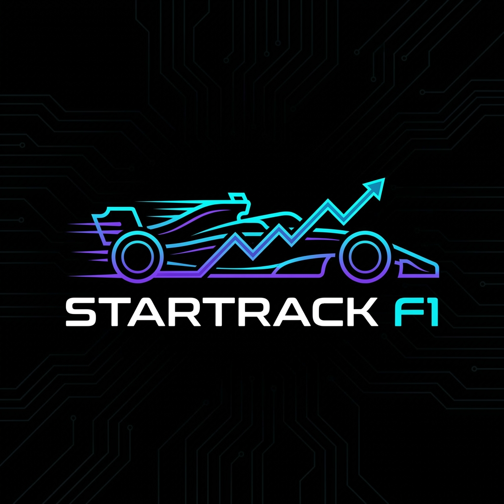

# <div align="center">StarTrack F1</div>

<div align="center">
  
  <br/>
  <h3>Advanced Motorsport Analytics & Circuit Design Engine</h3>
  <br/>
  
  <br/>
  <p>An open-source, physics-driven Formula 1 simulation platform for track design, strategy modeling, and telemetry analysis.</p>

  [](https://opensource.org/licenses/MIT)
  [](https://reactjs.org/)
  [](https://fastapi.tiangolo.com/)
  []()
</div>

---

## 🏎️ Overview

**StarTrack F1** is a cutting-edge web application that brings F1-style engineering tools to your browser. Unlike arcade games, StarTrack focuses on **simulation fidelity** and **data analytics**. It allows users to design custom circuits, simulate lap times using a physics-based vehicle model, and analyze strategy scenarios with professional telemetry visualizations.

### ⚠️ Legal Disclaimer
> **"StarTrack F1 is an independent open-source project and is not affiliated with, endorsed by, or connected to Formula 1, Formula One Management, or the FIA."**
> Does not use any proprietary F1 data or trademarks.

---

## ✨ Key Features

### 1. 🎨 Professional Circuit Designer
Design your dream tracks with a vector-based editor that mimics real-world CAD tools.
*   **Vector Splines**: Draws smooth, realistic racing lines using Catmull-Rom splines.
*   **Intelligent Snapping**: Precision grid system for accurate geometry.
*   **Dynamic Rendering**: Visualizes track speed heatmaps (Red=Slow / Cyan=Fast).
*   **Persistence**: Save and Load your custom circuit designs locally.

### 2. 🧪 Physics V2 Engine
Powered by a custom Python backend (FastAPI + NumPy) that simulates vehicle dynamics at 100Hz.
*   **ERS Simulation**: Fully modeled Energy Recovery System (MGU-K) with 4MJ/lap deployment limits, harvesting in braking zones, and 120kW "Overtake" boost.
*   **Tire Model**: Simulates degradation (wear) for Soft (C5), Medium (C3), and Hard (C1) compounds.
*   **Aero & Grip**: Calculates cornering speeds based on downforce, drag, and mechanical grip.

### 3. 📊 Broadcast-Grade Telemetry
Visualize performance data just like the race engineers on the pit wall.
*   **Live Charts**: Real-time rendering of Speed, Throttle, and Battery (SOC) traces.
*   **Strategy Tools**: Toggle between Dry, Hot, and Rain weather conditions to see impact on lap times.
*   **Sector Analysis**: Breakdown of performance across straight-line speed vs. cornering G-force.

---

## 🛠️ Technology Stack

| Component | Tech | Details |
| :--- | :--- | :--- |
| **Frontend** | React 18 | Components, Hooks, Context API |
| **Styling** | CSS3 | Glassmorphism, Neon UI, Responsive Grid |
| **Backend** | Python 3.10+ | FastAPI, Pydantic, Uvicorn |
| **Physics** | NumPy | Vectorized calculations for simulation |
| **Build** | Vite | High-performance tooling |

---

## 🚀 Getting Started

### Prerequisites
*   Node.js (v18+)
*   Python (3.10+)

### Installation

1.  **Clone the Repository**
    ```bash
    git clone https://github.com/poleposition-labs/startrack-f1.git
    cd startrack-f1
    ```

2.  **Setup Backend (Physics Engine)**
    ```bash
    cd backend
    pip install -r requirements.txt
    uvicorn main:app --reload
    # Server runs on http://localhost:8000
    ```

3.  **Setup Frontend (UI)**
    ```bash
    # Open new terminal
    cd frontend
    npm install
    npm run dev
    # App runs on http://localhost:5173
    ```

---


## 🤝 Contributing

We welcome contributions from the community! Whether it's adding a new simulation parameter, improving the UI, or fixing bugs.
Please read [CONTRIBUTING.md](CONTRIBUTING.md) for details on our code of conduct and the process for submitting pull requests.

## 📜 License

Distributed under the **MIT License**. See `LICENSE` for more information.

<div align="center">
  <sub>Built with ❤️ by Ismail Tasdelen</sub>
</div>
